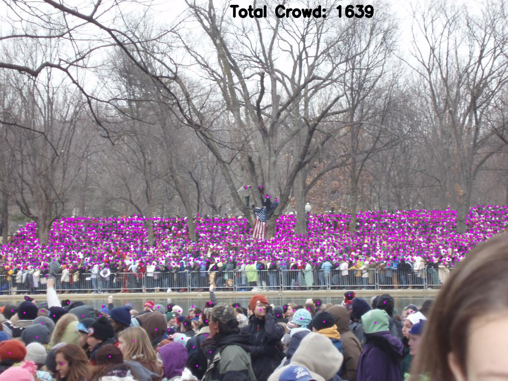
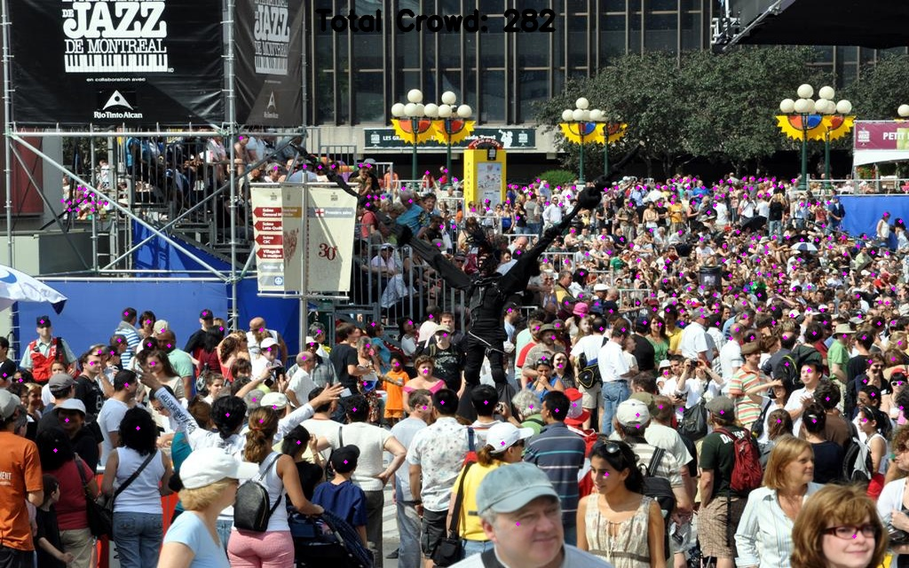
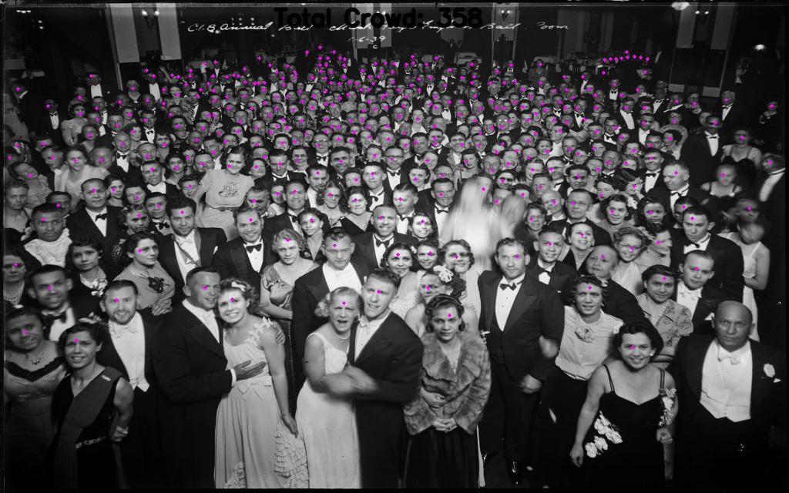

# P2PNet (ICCV2021 Oral Presentation)

This repository contains codes for the  **P2PNet** and **Deep Privacy**
 
A brief introduction of P2PNet can be found at [机器之心 (almosthuman)](https://mp.weixin.qq.com/s?__biz=MzA3MzI4MjgzMw==&mid=2650827826&idx=3&sn=edd3d66444130fb34a59d08fab618a9e&chksm=84e5a84cb392215a005a3b3424f20a9d24dc525dcd933960035bf4b6aa740191b5ecb2b7b161&mpshare=1&scene=1&srcid=1004YEOC7HC9daYRYeUio7Xn&sharer_sharetime=1633675738338&sharer_shareid=7d375dccd3b2f9eec5f8b27ee7c04883&version=3.1.16.5505&platform=win#rd).

The codes is tested with PyTorch 1.5.0. It may not run with other versions.

## Visualized demos for P2PNet
   
 
 

## The network
The DeepPrivacy GAN never sees any privacy sensitive information, ensuring a fully anonymized image. 
It utilizes bounding box annotation to identify the privacy-sensitive area, and sparse pose information to guide the network in difficult scenarios.
DeepPrivacy detects faces with state-of-the-art detection methods.
[Mask R-CNN](https://arxiv.org/abs/1703.06870) is used to generate a sparse pose information of the face, and [DSFD](https://arxiv.org/abs/1810.10220) is used to detect faces in the image.


The overall architecture of the P2PNet. Built upon the VGG16, it firstly introduce an upsampling path to obtain fine-grained feature map. 
Then it exploits two branches to simultaneously predict a set of point proposals and their confidence scores.

   

## Installation
* Clone this repo into a directory named P2PNET_ROOT
* Organize your datasets as required
* Install Python dependencies. We use python **3.9.1** and pytorch **1.8.1**


to install pytorch with cuda.. please run

```
pip install torch==1.8.1+cu111 torchvision==0.9.1+cu111 torchaudio==0.8.1 -f https://download.pytorch.org/whl/torch_stable.html
```

to complete other dependencies Run

```
pip install -r requirements.txt
```

## Organize the counting dataset
We use a list file to collect all the images and their ground truth annotations in a counting dataset. When your dataset is organized as recommended in the following, the format of this list file is defined as:
```
train/scene01/img01.jpg train/scene01/img01.txt
train/scene01/img02.jpg train/scene01/img02.txt
...
train/scene02/img01.jpg train/scene02/img01.txt
```

### Dataset structures:
```
DATA_ROOT/
        |->train/
        |    |->scene01/
        |    |->scene02/
        |    |->...
        |->test/
        |    |->scene01/
        |    |->scene02/
        |    |->...
        |->train.list
        |->test.list
```
DATA_ROOT is your path containing the counting datasets.


### Annotations format
For the annotations of each image, we use a single txt file which contains one annotation per line. Note that indexing for pixel values starts at 0. The expected format of each line is:
```
x1 y1
x2 y2
...
```

the dataset is situated in **new_public_density_data\ShanghaiTech**


## Training

The network can be trained using the `train.py` script. For training on SHTechPartA, use

```
python crowd_counting_train.py --dataset_file SHHA  --epochs 3500  --lr_drop 3500 --output_dir ./log  --checkpoints_dir ./checkpoints  --tensorboard_dir ./log  --lr 0.0001  --lr_backbone 0.00001  --batch_size 8  --eval  --gpu_id 0 --eval_freq 10
```
By default, a periodic evaluation will be conducted on the validation set.

## Testing

A trained model (with an MAE of **55.76922989**) on SHTechPartA is available at "./checkpoints", run the following commands to launch a visualization demo:

```
python run_test.py --weight_path ./weights/best_mae.pth --output_dir ./logs/
```

In order to test the pretrained model by use this.

```
python run_test.py --weight_path ./weights/SHTechA.pth --output_dir ./logs/
```


## Running the Project

To create a single anonimised image you can use the **mainsystem.py** file 

```
python mainsystem.py
```

To run multiple image to anonimize and crowd cound and return a density map on said image, Run-->

```
  python test_anonimised_crowd.py
```

this will take images from  `./input` folder and save the output in `./output` folder.


### NOTE:

- Running this project do not require GPU .. however for training and testing it is recommended to use GPU with cuda support

- Both running the single and multi Image script to generate results uses a merged inference of two models .. and the configurations are saved in the respective files as two classes as `P2pConfigs` and `DeepPrivacyConfig` classes.
you change up the configs from there.


